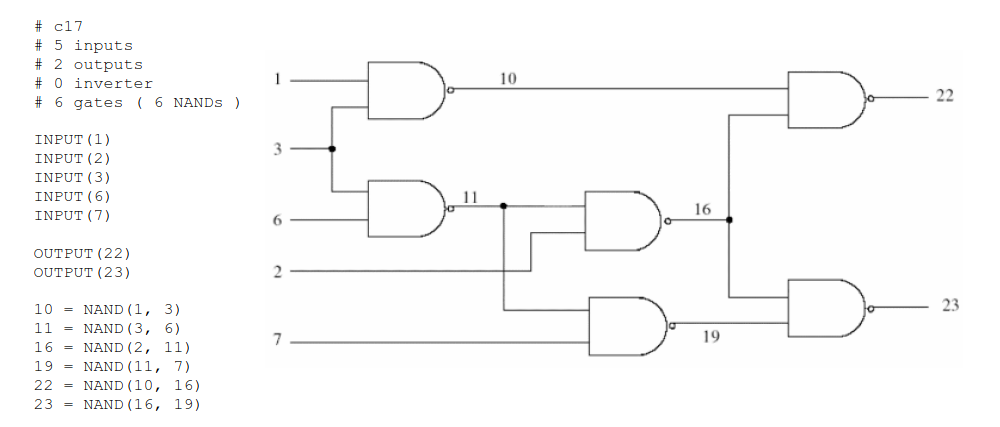

# Deductive Fault Simulator

According to the [this](https://doi-org.access.semantak.com/10.1109/T-C.1972.223542) "deductive fault simulation" is a method which "deduces" the faults defected by a test at the same time that it simulates explicitly only the good behavior of logic circuit. For large logic circuits (at least several thousand gates) it is expected to be faster than "parallel" fault simulators, but uses much more computer memory than do parallel simulators.

This tool is a simulator that reads a logic circuit file using ISCAS standard format and runs a deductive fault simulation based on the input vector that is given to it.


_c17.bench file and its corresponding circuit_

<br/><br/><br/>

This was originally my project for the "testability" course I had last semester. The script also runs "true-value simulation" and "fault table analysis" on the circuit, although it may still needs some tweaks.

## Installation

* Download the code
* Run the script `main.py`
```
$ python3 main.py [circuit file] [true-value simulation input file] [deductive fault simulation input file]
```

I also included a `test_vector_generator.py` script for large circuits. It reads a circuit file and generates two input files, `true_value_input.txt` and `deductive_fault_input.txt`. And this is to use it:
```
$ python3 test_vector_generator.py [circuit file]
```

## Contact
- [Mahdi-R](https://github.com/1MahdiR) : a.m.rasouli.n@gmail.com
- [Linkedin](https://www.linkedin.com/in/amir-mahdi-rasouli-39566a143/)

## Contributing

Contributions are what make the open source community such an amazing place to learn, inspire, and create. Any contributions you make are **greatly appreciated**.

1. Fork the Project
2. Create your Feature Branch (`git checkout -b feature/AmazingFeature`)
3. Commit your Changes (`git commit -m 'Add some AmazingFeature'`)
4. Push to the Branch (`git push origin feature/AmazingFeature`)
5. Open a Pull Request

## License

[GPL-3.0 License](https://github.com/1MahdiR/Deductive-Fault-Simulator/blob/master/LICENSE)